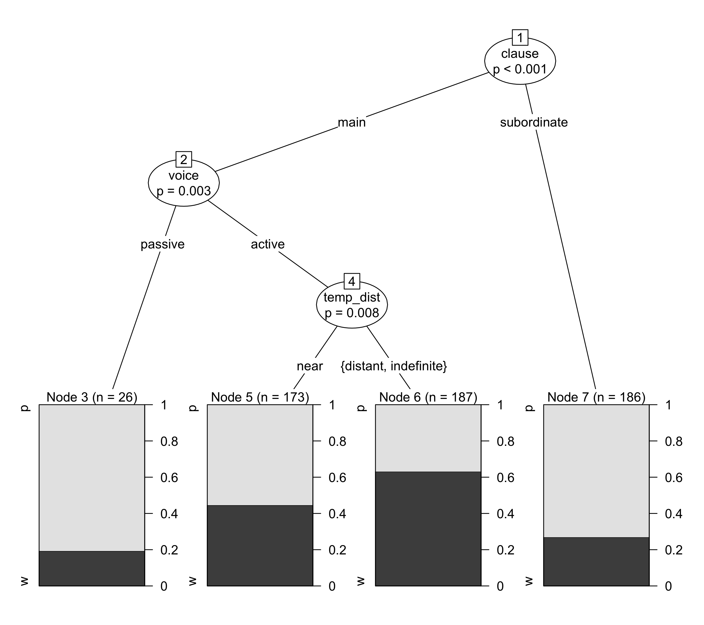
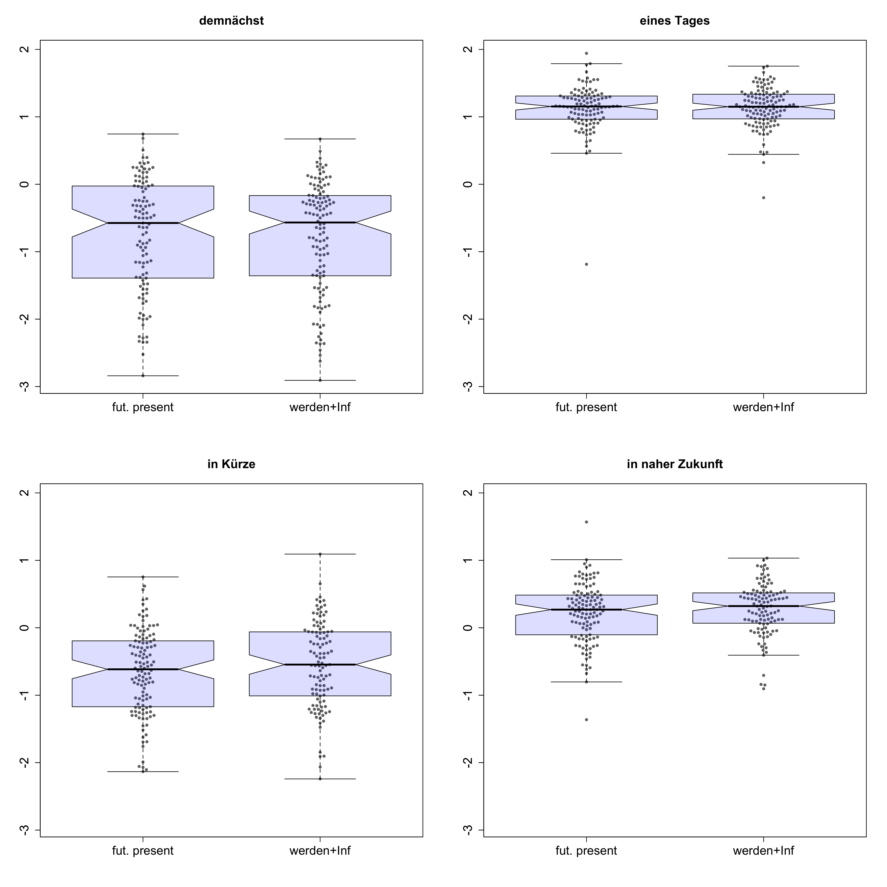

## *werden* + Infinitive vs. futurate present

(1)&nbsp;&nbsp;&nbsp;&nbsp;&nbsp;&nbsp;Ich werde morgen ins Kino gehen.

&nbsp;&nbsp;&nbsp;&nbsp;&nbsp;&nbsp;&nbsp;&nbsp;&nbsp;&nbsp;'I will go to the cinema tomorrow.'
      
 

(2)&nbsp;&nbsp;&nbsp;&nbsp;&nbsp;&nbsp;Ich gehe morgen ins Kino.

&nbsp;&nbsp;&nbsp;&nbsp;&nbsp;&nbsp;&nbsp;&nbsp;&nbsp;&nbsp;(lit.) 'I go to the cinema tomorrow'

---

## Overview

- Previous research

- Corpus study: DWDS21

- Experimental study

---

## *werden* + Infinitive vs. futurate present

(1)&nbsp;&nbsp;&nbsp;&nbsp;&nbsp;&nbsp;Ich **werde** morgen ins Kino **gehen**.

&nbsp;&nbsp;&nbsp;&nbsp;&nbsp;&nbsp;&nbsp;&nbsp;&nbsp;&nbsp;'I will go to the cinema tomorrow.'
      
 

(2)&nbsp;&nbsp;&nbsp;&nbsp;&nbsp;&nbsp;Ich **gehe** morgen ins Kino.

&nbsp;&nbsp;&nbsp;&nbsp;&nbsp;&nbsp;&nbsp;&nbsp;&nbsp;&nbsp;(lit.) 'I go to the cinema tomorrow'

---

## Previous research

> - frequency distribution of both constructions: findings differ considerably (Žuikin 1975; Brons-Albert 1982; Matzel & Ulvestad 1982; Thieroff 1992)
> - Matzel & Ulvestad (1982): comparison of *werden* + Inf. vs. futurate present regarding temporal vs. modal/epistemic readings
> - Hilpert (2008): distinctive collexeme analysis - futurate present prefers telic verbs like *kommen* ‘come’ and *finden* ‘find’; *werden* + Infinitive “exhibits a preference for continuative events that unfold spontaneously” (Hilpert 2008: 176)
> - Hacke (2009): *werden* + Inf. entails a different "perspectivation" of the proposition - distance between (time of) utterance and (time of) proposition
> - Gelhaus (1975): *werden* + Inf. adds "pathos" and "emotional weight" to the utterance

---

## Present study

- Which factors determine the choice of werden + Inf. vs. futurate present in contemporary German?

- Does the choice of *werden* + Inf. over the futurate present lead to differences in the interpretation of utterances?

---

## Corpus study

- database: DWDS core corpus of the 21st century
- search for future-related temporal adverbials like *morgen*, *bald*, etc. (search terms from Hilpert 2008)
- 5000 hits randomly selected - 572 datapoints after manual deletion of false hits
- manually annotated for
  - **CONSTRUCTION**: Is the futurate present or the werden + Infinitive construction used in the sentence?
  - **NEGATION**: Is the proposition negated?
  - **CLAUSE**: Does the construction occur in a main clause or a subordinate clause?
  - **VOICE**: Is the sentence in which the construction occurs framed in the active or in the passive voice?
  - **TEMPORAL DISTANCE**: Proximity of the event, if it can be inferred from the temporal adverbial
  - **VERB LEMMA**: The lemma of the full verb.

---

## Corpus Study: Method

> - Conditional inference trees and random forests (Tagliamonte & Baayen 2012, Schneider 2014, Levshina 2015)

> - Basic idea: recursive partitioning - algorithm identifies most influential predictor variable and makes a binary split in this variable; this is repeated until no significant predictors are left

> - p-values obtained via permutation: labels on the observed data points are randomly rearranged - if this doesn't make a difference for the model, the predictor probably isn't important; if it does, the predictor is considered influential.

> - random forests consist of many conditional inference trees and yield the importance measure for every variable in the model averaged over many conditional trees (Levshina 2015: 292)

---

## Corpus study: Results

</img>

---

## Corpus study: Results

</img>

---

## Interim conclusion: Corpus study

- TEMPORAL DISTANCE seems to make a difference: *werden* + Inf. preferred over futurate present when the sentence relates to the more distant future

- CLAUSE and VOICE as important formal predictors

- however: results are very preliminary at this point!

---

## Corpus study

- near vs. distant future

- near: up to 1 year or indefinite adverbials referring to the near future, e.g. *bald*, *demnächst*

- distant: > 1 year, indefinite adverbials referring to more distant future, e.g. *in ferner Zukunft*

<table class="table table-striped table-hover table-condensed" style="width: auto !important; margin-left: auto; margin-right: auto;">
 <thead>
  <tr>
   <th style="text-align:center;">  </th>
   <th style="text-align:center;"> near </th>
   <th style="text-align:center;"> distant </th>
   <th style="text-align:center;"> indefinite </th>
  </tr>
 </thead>
<tbody>
  <tr>
   <td style="text-align:center;"> futurate present </td>
   <td style="text-align:center;"> 123 </td>
   <td style="text-align:center;"> 102 </td>
   <td style="text-align:center;"> 97 </td>
  </tr>
  <tr>
   <td style="text-align:center;"> werden + Infinitive </td>
   <td style="text-align:center;"> 60 </td>
   <td style="text-align:center;"> 96 </td>
   <td style="text-align:center;"> 94 </td>
  </tr>
</tbody>
</table>

---

## Experimental study

- inspired by experimental approaches to progressive vs. non-progressive framing in Dutch and German (Flecken & Gerwien 2013, Hartmann 2016)

- designed with *jsPsych* (de Leeuw 2016)

- focus on the construal of temporal distance

---

## Experimental study

<iframe src="http://pfriemelpfuhl.bplaced.net/TenseExperiment/Exp/TempSurvey%20copy%202.html"></iframe>

---

## Experimental study: Results

- 94 volunteer participants (48 f, 38 m, 8 NA) 

- 17 participants had to be excluded (16 did not move the slider, 1 did not state German as their native language)

- analysis using mixed-effects modeling

---

## Experimental study: Results

- data were log-transformed and *z*-scored

<iframe src="https://hartmast.shinyapps.io/exp-app2/"></iframe>

---

## Experimental study: Results

</img>

---

## Experimental study: Results

- Model definition: distance_estimate ~  adverbial + framing + (1 | subject) + (1 | proposition)

<table class="table table-striped table-hover table-condensed" style="width: auto !important; margin-left: auto; margin-right: auto;">
 <thead>
  <tr>
   <th style="text-align:center;">  </th>
   <th style="text-align:center;"> Estimate </th>
   <th style="text-align:center;"> Std. Error </th>
   <th style="text-align:center;"> df </th>
   <th style="text-align:center;"> t-value </th>
   <th style="text-align:center;"> Pr(&gt;|t|) </th>
  </tr>
 </thead>
<tbody>
  <tr>
   <td style="text-align:center;"> (Intercept) </td>
   <td style="text-align:center;"> -0.63 </td>
   <td style="text-align:center;"> 0.17 </td>
   <td style="text-align:center;"> 12 </td>
   <td style="text-align:center;"> -3.66 </td>
   <td style="text-align:center;"> 0.0032** </td>
  </tr>
  <tr>
   <td style="text-align:center;"> adv: demnächst </td>
   <td style="text-align:center;"> -0.16 </td>
   <td style="text-align:center;"> 0.24 </td>
   <td style="text-align:center;"> 12 </td>
   <td style="text-align:center;"> -0.68 </td>
   <td style="text-align:center;"> 0.5109 </td>
  </tr>
  <tr>
   <td style="text-align:center;"> adv: in naher Zukunft </td>
   <td style="text-align:center;"> 0.85 </td>
   <td style="text-align:center;"> 0.24 </td>
   <td style="text-align:center;"> 12 </td>
   <td style="text-align:center;"> 3.52 </td>
   <td style="text-align:center;"> 0.0043** </td>
  </tr>
  <tr>
   <td style="text-align:center;"> adv: eines Tages </td>
   <td style="text-align:center;"> 1.75 </td>
   <td style="text-align:center;"> 0.24 </td>
   <td style="text-align:center;"> 12 </td>
   <td style="text-align:center;"> 7.15 </td>
   <td style="text-align:center;"> 1.20E-05*** </td>
  </tr>
  <tr>
   <td style="text-align:center;"> framing: werden </td>
   <td style="text-align:center;"> 0.05 </td>
   <td style="text-align:center;"> 0.03 </td>
   <td style="text-align:center;"> 914 </td>
   <td style="text-align:center;"> 1.50 </td>
   <td style="text-align:center;"> 0.1351 </td>
  </tr>
</tbody>
</table>

---

## Conclusion

- *werden* + Infinitive and futurate present can be used exchangably to a considerable extent

- In language production, there seems to be a slight preference for *werden* + Inf. when referring to distant-future events

- In language comprehension, the use of *werden* + Infinitive does not seem to entail a difference in event construal (at least in the presence of a temporal adverbial)

---

## Outlook

- Both studies presented here limited to future-related utterances **with temporal adverbial**

- results can help understand important aspects of the semantics of both constructions - but for a fuller understanding, follow-up studies are needed

- follow-up corpus studies should take data **without** temporal adverbials into account and add the presence or absence of temporal adverbials as a further predictor

- follow-up experimental studies should use a more balanced set of propositions in their stimuli sentences

- also, a cross-linguistic approach seems desirable

--- {
 tpl: thankyou
}

## Thank You!

stefan1.hartmann[at]uni-bamberg.de
